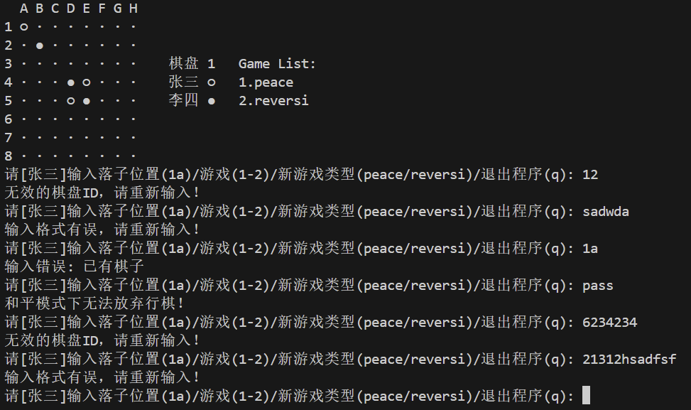
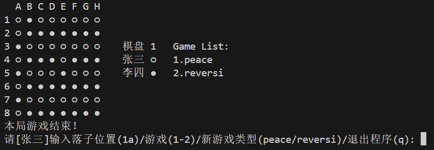
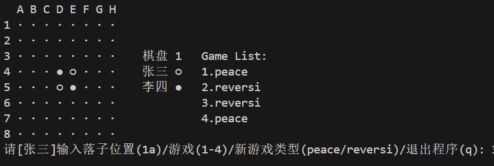
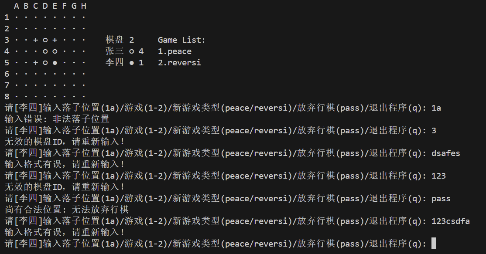
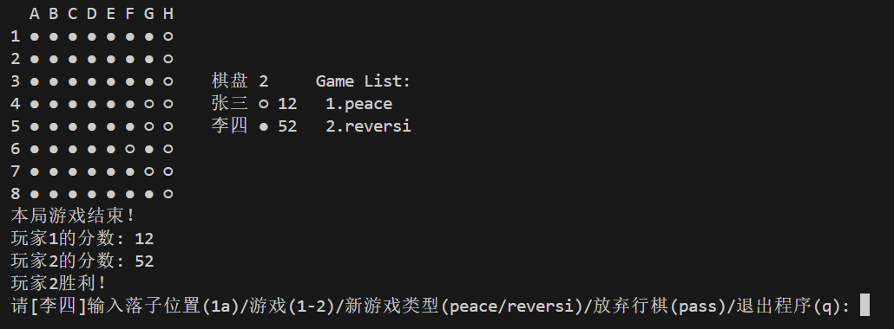

# Lab 4
## 一、源代码文件名称及其主要功能：
### 1. `Main.java:`
```
classDiagram
    class Main {
        + main(String[] args)
    }
```
#### 变量和方法说明
##### 变量
| 变量名           | 访问权限  | 类型             | 说明 |
|------------------|-----------|------------------|------|
| `scanner`        | `private` | `Scanner`        | 用于从控制台读取玩家输入。 |
| `player1`        | `private` | `Player`         | 玩家 1 的信息。 |
| `player2`        | `private` | `Player`         | 玩家 2 的信息。 |
| `game1`          | `private` | `Game`           | 游戏 1 (Reversi 模式)。 |
| `game2`          | `private` | `Game`           | 游戏 2 (Peace 模式)。 |
| `currentGame`    | `private` | `Game`           | 当前游戏（默认为 `game1`）。 |

#### 方法
| 方法名         | 访问权限 | 返回类型  | 说明 |
|----------------|----------|-----------|------|
| `main(String[] args)` | `public` | `void`    | 主方法，程序入口点，负责创建玩家、初始化游戏并开始游戏。 |

---

#### 文字说明

1. **`Main` 类**:
   - `Main` 类是程序的入口，负责创建玩家对象并初始化两种游戏模式（Reversi 和 Peace），最后启动游戏。
   - 用户通过控制台输入玩家名称，系统根据输入的玩家名称初始化两个玩家对象。

2. **`main` 方法**:
   - 读取用户输入的玩家名称并创建两个 `Player` 对象。
   - 创建两个 `Game` 对象，分别代表两种游戏模式（`reversi` 和 `peace`）。
   - 默认设置当前游戏模式为 `reversi` 模式，并调用 `playGame()` 方法开始游戏。
   - 最后，关闭 `Scanner` 对象，释放资源。

---

#### 整体功能流程

- **输入**: 用户通过控制台输入两位玩家的名字。
- **初始化**: 游戏创建两个模式（`reversi` 和 `peace`）的 `Game` 对象，并根据默认设置选择 `game1`（`reversi`）作为当前游戏。
- **游戏开始**: 调用 `currentGame.playGame()` 方法开始游戏。

---

### 2. `Game.java:`
```mermaid
classDiagram
    class Game {
        + Game(String mode, Player player1, Player player2)
        + switchPlayer()
        + playGame()
    }
```

#### 变量和方法说明

##### 变量
| 变量名           | 访问权限  | 类型             | 说明 |
|------------------|-----------|------------------|------|
| `allGames`       | `private` | `ArrayList<Game>` | 用于存储所有创建的 `Game` 对象。 |
| `player1`        | `final`   | `Player`         | 玩家 1 的信息。 |
| `player2`        | `final`   | `Player`         | 玩家 2 的信息。 |
| `board`          | `private` | `Board`          | 当前游戏的棋盘。 |
| `mode`           | `final`   | `String`         | 当前游戏模式，`reversi` 或 `peace`。 |
| `currentPlayer`  | `private` | `Player`         | 当前轮到的玩家。 |
| `scanner`        | `private` | `Scanner`        | 只创建一次用于读取玩家输入的扫描器。 |

##### 方法
| 方法名            | 访问权限 | 返回类型  | 说明 |
|-------------------|----------|-----------|------|
| `Game(String mode, Player player1, Player player2)` | `public` | `void`    | 构造函数，初始化游戏模式、玩家信息，并设置棋盘类型（Reversi 或 Peace）。 |
| `switchPlayer()`   | `public` | `void`    | 切换当前玩家。 |
| `playGame()`       | `public` | `void`    | 启动游戏主循环，控制游戏流程和输入，处理用户输入、检查游戏结束等。 |

---

#### 文字说明

1. **`Game` 类**:
   - 该类代表一个完整的游戏，负责管理玩家、棋盘、游戏模式以及当前玩家的切换。
   - 游戏模式可以是 Reversi 或 Peace，根据输入的模式选择不同的棋盘类型。

2. **`Game(String mode, Player player1, Player player2)` 构造函数**:
   - 初始化游戏模式、玩家信息，并设置棋盘（`ReversiBoard` 或 `PeaceBoard`）。
   - 将当前游戏添加到全局 `allGames` 列表中以便进行棋盘切换。

3. **`switchPlayer()` 方法**:
   - 用于切换当前玩家（从玩家1切换到玩家2或反之）。

4. **`playGame()` 方法**:
   - 游戏主循环，在此方法中处理玩家输入（如落子、切换棋盘、游戏结束检查等）。
   - 游戏结束时显示分数，并根据游戏模式输出游戏结果。
   - 处理各种输入情况，如切换棋盘、改变游戏模式、放弃行棋、退出等。

---

#### 整体功能流程

- **输入**: 玩家根据提示输入落子位置、切换棋盘、游戏模式或退出。
- **处理**: 游戏会根据玩家输入的不同内容，进行相应的处理：
  - 如果输入的是棋盘位置（如 1a），系统会检查该位置是否合法，并进行落子。
  - 如果输入的是数字，系统会切换到对应的棋盘并重新开始游戏。
  - 输入 `pass` 则跳过当前玩家的回合。
  - 输入 `q` 会退出程序。
- **输出**: 每次玩家操作后，都会打印更新后的棋盘和相关信息。游戏结束时显示玩家的分数并宣布胜利者。

---

### 3. `Board.java:`
- 功能：
  - 定义了一个名为 `Board` 的类，用于表示一个棋盘对象。
  - 包含了棋盘的大小、棋盘的状态以及一些与棋盘操作相关的方法。
  - 负责初始化棋盘，打印棋盘状态以及进行一些基本的验证操作（如检查是否有合法的落子位置）。
```
classDiagram
    class Board {
        + static ArrayList<Board> allBoards
        + final static int SIZE
        + int[][] chessBoard
        + static int chessBoardCount
        + int boardID

        + Board()
        + void initBoard()
        + int calculateScore(Player player)
        + void printBoard(Player player1, Player player2, Player currentPlayer)
        + void clearScreen()
        + int isValidMove(int row, int col, Player currentPlayer)
        + boolean isGameOver(Player currentPlayer)
    }
```

#### 变量和方法说明

#### 变量
| 变量名               | 访问权限  | 类型                 | 说明 |
|----------------------|-----------|----------------------|------|
| `allBoards`          | `static`  | `ArrayList<Board>`    | 用于存储所有创建的 `Board` 对象。 |
| `SIZE`               | `final static` | `int`               | 棋盘的大小（默认 8x8）。 |
| `chessBoard`         | `private` | `int[][]`            | 代表棋盘的二维数组。 |
| `chessBoardCount`    | `static`  | `int`                | 记录创建的棋盘数量。 |
| `boardID`            | `private` | `int`                | 记录当前棋盘的 ID。 |

#### 方法

| 方法名                       | 访问权限 | 返回类型     | 说明 |
|------------------------------|----------|--------------|------|
| `Board()`                    | `public` | `Board`      | 构造方法，初始化棋盘并设置 ID。 |
| `initBoard()`                | `public` | `void`       | 初始化棋盘，设置初始棋盘状态。 |
| `calculateScore(Player player)` | `public` | `int`        | 计算并返回给定玩家的分数（当前返回 0，具体实现可以根据实际需求补充）。 |
| `printBoard(Player player1, Player player2, Player currentPlayer)` | `public` | `void` | 打印当前棋盘状态及相关信息，包括棋盘、玩家名称、棋盘 ID 和游戏列表。 |
| `clearScreen()`              | `public` | `void`       | 清屏，执行操作后刷新屏幕。 |
| `isValidMove(int row, int col, Player currentPlayer)` | `public` | `int` | 检查玩家的落子是否合法，返回错误码（1：越界，2：已有棋子，0：合法）。 |
| `isGameOver(Player currentPlayer)` | `public` | `boolean`    | 检查游戏是否结束，返回 `true` 或 `false`，取决于棋盘上是否还有合法空位。 |

---

#### 文字说明

1. **`Board` 类**:
   - `Board` 类代表了一个棋盘对象，包含棋盘的大小、棋盘的状态和一些与棋盘操作相关的方法。
   - 它还负责初始化棋盘，打印棋盘状态以及进行一些基本的验证操作（如检查是否有合法的落子位置）。
   
2. **构造方法 `Board()`**:
   - 初始化棋盘的二维数组 `chessBoard`。
   - 每次创建棋盘时，增加 `chessBoardCount` 计数器，并将该棋盘对象添加到 `allBoards` 列表中。

3. **`initBoard()` 方法**:
   - 初始化棋盘的状态，默认设置四个中心位置上的棋子，代表一种初始游戏状态。

4. **`calculateScore(Player player)` 方法**:
   - 用于计算并返回指定玩家的分数。当前返回值为 0，具体的分数计算可以根据游戏规则进一步实现。

5. **`printBoard()` 方法**:
   - 打印当前棋盘状态，包括棋盘的每一行和列标识，以及每个位置上的棋子。
   - 在棋盘上还会显示游戏的相关信息，如玩家名称和棋盘 ID。

6. **`clearScreen()` 方法**:
   - 清空控制台屏幕，确保每次打印棋盘时有一个干净的界面。

7. **`isValidMove(int row, int col, Player currentPlayer)` 方法**:
   - 判断玩家所选位置是否有效。返回不同的错误码（1：越界，2：已有棋子，0：合法）。

8. **`isGameOver(Player currentPlayer)` 方法**:
   - 检查游戏是否结束，通过遍历棋盘判断是否还有空位可以放置棋子。如果没有空位则返回 `true`，表示游戏结束。

---

### 4. `Player.java:`
```mermaid
classDiagram
    class Player {
        + Player(String name, char symbol, int playerID)
        + getName() String
        + getSymbol() char
        + getPlayerID() int
    }
```

##### 变量和方法说明

##### 变量
| 变量名           | 访问权限  | 类型   | 说明 |
|------------------|-----------|--------|------|
| `name`           | `private` | `String` | 玩家名称。 |
| `symbol`         | `private` | `char`   | 玩家棋子的符号。 |
| `playerID`       | `private` | `int`    | 玩家ID，用于区分玩家。 |

##### 方法
| 方法名            | 访问权限 | 返回类型  | 说明 |
|-------------------|----------|-----------|------|
| `Player(String name, char symbol, int playerID)` | `public` | `void`    | 构造函数，初始化玩家信息，包括名称、棋子符号和玩家ID。 |
| `getName()`       | `public` | `String`  | 获取玩家的名称。 |
| `getSymbol()`     | `public` | `char`    | 获取玩家的棋子符号。 |
| `getPlayerID()`   | `public` | `int`     | 获取玩家的ID。 |

---

##### 文字说明

1. **`Player` 类**:
   - 该类用于表示一个玩家，存储玩家的名称、棋子符号和ID。
   - 通过 `Player` 类，可以访问玩家的基本信息，确保玩家在游戏中的标识和行为的一致性。

2. **`Player(String name, char symbol, int playerID)` 构造函数**:
   - 用于初始化玩家的名称、棋子符号和ID。玩家ID用于区分玩家（例如，玩家1和玩家2）。

3. **`getName()` 方法**:
   - 返回玩家的名称。

4. **`getSymbol()` 方法**:
   - 返回玩家的棋子符号，如 '●' 或 '○'。

5. **`getPlayerID()` 方法**:
   - 返回玩家的ID，用于区分不同的玩家。

---

##### 类的功能

- **输入**: 通过构造函数输入玩家的基本信息（如名称、棋子符号和ID）。
- **输出**: 提供访问玩家信息的方法，如获取玩家的名称、符号和ID，确保在游戏中使用时能正确区分不同玩家。
---
### 5. `PeaceBoard.java:`Board的子类之一
```mermaid
classDiagram
    class ReversiBoard {
        + ReversiBoard()
        + isValidMove(row: int, col: int, currentPlayer: Player): int
        + calculateScore(player: Player): int
        + printBoard(player1: Player, player2: Player, currentPlayer: Player): void
        + flipPieces(row: int, col: int, currentPlayer: Player): void
        + isGameOver(currentPlayer: Player): boolean
    }
```

#### 变量和方法说明

##### 变量
| 变量名             | 访问权限  | 类型        | 说明           |
|--------------------|-----------|-------------|----------------|
| `chessBoard`       | `protected`| `int[][]`   | 存储棋盘状态，二维数组表示每个格子的状态（0为空，1为玩家1，2为玩家2）。 |
| `SIZE`             | `protected`| `int`       | 棋盘大小，默认 8x8。 |
| `allBoards`        | `protected`| `List<Board>` | 存储所有棋盘的集合。 |

##### 方法
| 方法名                        | 访问权限 | 返回类型  | 说明                           |
|-------------------------------|----------|-----------|--------------------------------|
| `ReversiBoard()`               | `public` | `void`    | 构造函数，初始化 `ReversiBoard` 对象。 |
| `isValidMove(int row, int col, Player currentPlayer)` | `public` | `int`    | 检查给定位置是否为合法的落子位置。 |
| `calculateScore(Player player)` | `public` | `int`    | 计算并返回给定玩家的分数。 |
| `printBoard(Player player1, Player player2, Player currentPlayer)` | `public` | `void`    | 打印棋盘及当前游戏状态。 |
| `flipPieces(int row, int col, Player currentPlayer)` | `public` | `void`    | 翻转对方棋子，将其变为当前玩家的棋子。 |
| `isGameOver(Player currentPlayer)` | `public` | `boolean` | 检查游戏是否结束。 |

---

#### 方法说明

1. **`ReversiBoard()`**:
   - 构造函数，调用父类 `Board` 的构造方法来初始化棋盘，并设置棋盘类型为 `Reversi`。

2. **`isValidMove(int row, int col, Player currentPlayer)`**:
   - 检查给定的 `row` 和 `col` 位置是否为当前玩家合法的落子位置。
   - 遍历八个方向，检查是否存在对方棋子并被自己的棋子夹住。

3. **`calculateScore(Player player)`**:
   - 遍历棋盘，统计当前玩家的棋子数量，计算并返回玩家的得分。

4. **`printBoard(Player player1, Player player2, Player currentPlayer)`**:
   - 打印当前棋盘的状态，并显示玩家1和玩家2的得分信息。

5. **`flipPieces(int row, int col, Player currentPlayer)`**:
   - 遍历八个方向，在合法的情况下将对方的棋子翻转为当前玩家的棋子。

6. **`isGameOver(Player currentPlayer)`**:
   - 检查当前玩家是否没有合法的落子位置，如果没有合法位置则游戏结束。

---

#### 类的功能

- **棋盘初始化与管理**: 继承自 `Board` 类，提供了 `Reversi` 游戏模式下的特定功能，包括合法性检查、翻转棋子和分数计算。
- **输入与输出**: 提供打印棋盘、显示得分、切换玩家等功能，支持游戏的流畅进行。
- **游戏逻辑**: 实现了基本的游戏逻辑，如落子验证、翻转棋子、判断游戏结束等。

---
### 6. `PeaceBoard.java:`Board的子类之一
```mermaid
classDiagram
    class PeaceBoard {
        + PeaceBoard()
    }
```

### 变量和方法说明

#### 变量
| 变量名             | 访问权限  | 类型        | 说明           |
|--------------------|-----------|-------------|----------------|
| `chessBoard`       | `protected`| `int[][]`   | 存储棋盘状态，二维数组表示每个格子的状态（0为空，1为玩家1，2为玩家2）。 |
| `SIZE`             | `protected`| `int`       | 棋盘大小，默认 8x8。 |
| `allBoards`        | `protected`| `List<Board>` | 存储所有棋盘的集合。 |

#### 方法
| 方法名                        | 访问权限 | 返回类型  | 说明                           |
|-------------------------------|----------|-----------|--------------------------------|
| `PeaceBoard()`                 | `public` | `void`    | 构造函数，初始化 `PeaceBoard` 对象。 |

---

### 方法说明

1. **`PeaceBoard()`**:
   - 构造函数，调用父类 `Board` 的构造方法来初始化棋盘，并设置棋盘类型为 `Peace`。

---

### 类的功能

- **棋盘初始化**: 继承自 `Board` 类，`PeaceBoard` 是一个空的实现类，当前没有新增的功能或规则，继承自 `Board` 只是为了作为一个不同类型的棋盘。
- **游戏逻辑扩展**: 可以在后期为 `PeaceBoard` 添加更多特定的游戏规则或功能。

---
## 二、关键代码及其设计思路：
以下是关键且较为复杂的代码部分及其设计思路。

---

### 1. `Game` 类 - `playGame` 方法

```java
public void playGame() {
    while (true) {
        board.printBoard(player1, player2, currentPlayer);
        while (true) {
            // 检查游戏是否结束
            if (board.isGameOver(player1,player2,currentPlayer)) {
                System.out.println("本局游戏结束！");
                break;
            }
            // 处理玩家输入
            String input = scanner.nextLine().toLowerCase();
            if (input.matches("^[1-8][a-h]$")) {
                row = input.charAt(0) - '1'; 
                col = input.charAt(1) - 'a'; 
                if (board.isValidMove(row, col, currentPlayer) == 0) {
                    board.chessBoard[row][col] = (currentPlayer == player1) ? 1 : 2;
                    if (board instanceof ReversiBoard) {
                        ((ReversiBoard) board).flipPieces(row, col, currentPlayer);
                    }
                    currentPlayer = (currentPlayer == player1) ? player2 : player1;
                    break;
                }
            }
        }
    }
}
```

**设计思路：**
- **游戏主循环**：通过 `while(true)` 保证游戏不断进行，直到满足结束条件。
- **检查游戏结束**：调用 `isGameOver()` 方法判断游戏是否结束。
- **玩家输入与验证**：接受玩家输入，验证输入是否合法，进行落子操作，并根据规则更新棋盘。
- **玩家切换**：每次成功落子后切换玩家。

---

### 2. `ReversiBoard` 类 - `isValidMove` 方法

```java
@Override
public int isValidMove(int row, int col, Player currentPlayer) {
    if (row < 0 || row >= SIZE || col < 0 || col >= SIZE) {
        return 1; // 越界
    } else if (chessBoard[row][col] != 0) {
        return 2; // 已有棋子
    }

    int[] dr = {-1, -1, -1, 0, 1, 1, 1, 0}; 
    int[] dc = {-1, 0, 1, 1, 1, 0, -1, -1};
    int opponent = (currentPlayer.getPlayerID() == 1) ? 2 : 1;

    for (int d = 0; d < 8; d++) {
        int r = row + dr[d], c = col + dc[d];
        boolean legalLocation = false;

        while (r >= 0 && r < SIZE && c >= 0 && c < SIZE && chessBoard[r][c] == opponent) {
            legalLocation = true;
            r += dr[d];
            c += dc[d];
        }

        if (legalLocation && r >= 0 && r < SIZE && c >= 0 && c < SIZE
            && chessBoard[r][c] == currentPlayer.getPlayerID()) {
            return 0; // 合法的落子位置
        }
    }
    return 3; // 非法落子位置
}
```

**设计思路：**
- **越界与已有棋子检查**：首先检查位置是否越界或已有棋子。
- **方向扫描**：通过八个方向的数组，检查是否有对方棋子夹住自己棋子，并验证落子是否合法。
- **返回值**：根据不同的错误情况返回不同的错误码，如越界、已有棋子或非法落子。

---

### 3. `ReversiBoard` 类 - `flipPieces` 方法

```java
public void flipPieces(int row, int col, Player currentPlayer) {
    int opponent = (currentPlayer.getPlayerID() == 1) ? 2 : 1;
    
    for (int dirRow = -1; dirRow <= 1; dirRow++) {
        for (int dirCol = -1; dirCol <= 1; dirCol++) {
            if (dirRow == 0 && dirCol == 0) continue;

            int i = row + dirRow, j = col + dirCol;
            boolean hasOpponentBetween = false;

            while (i >= 0 && i < SIZE && j >= 0 && j < SIZE) {
                if (chessBoard[i][j] == opponent) {
                    hasOpponentBetween = true;
                } else if (chessBoard[i][j] == currentPlayer.getPlayerID()) {
                    if (hasOpponentBetween) {
                        int k = row + dirRow, l = col + dirCol;
                        while (k != i || l != j) {
                            chessBoard[k][l] = currentPlayer.getPlayerID();
                            k += dirRow;
                            l += dirCol;
                        }
                    }
                    break;
                } else {
                    break;
                }
                i += dirRow;
                j += dirCol;
            }
        }
    }
}
```

**设计思路：**
- **翻转棋子**：根据 Reversi 的规则，在对方棋子之间找到自己的棋子后翻转对方棋子。
- **八个方向扫描**：使用两个循环检查八个方向，判断是否可以翻转对方棋子。
- **翻转操作**：当确认有对方棋子并夹住自己的棋子时，执行翻转操作。

---

### 4. `Game` 类 - 切换游戏模式

```java
else if (input.equals("peace")) { 
    Game newGame = new Game("peace", player1, player2);
    board.printBoard(player1, player2, currentPlayer);
}
else if (input.equals("reversi")) { 
    Game newGame = new Game("reversi", player1, player2);
    board.printBoard(player1, player2, currentPlayer);
}
```

**设计思路：**
- **切换模式**：通过输入指令 `"peace"` 或 `"reversi"` 创建新的游戏实例，切换不同的游戏模式。
- **即时更新棋盘**：在切换游戏模式后，调用 `printBoard` 输出当前游戏状态。

---
## 三、运行截图及简单说明
### 1.玩家信息录入:
玩家在控制台输入玩家的名称，系统会根据输入的名称创建两个玩家对象。其中玩家一默认黑子，玩家二默认白子。<br>

### 2.peace模式:
- 游戏开始后，系统会打印出当前棋盘状态，显示玩家的名称和棋盘编号，开始的时候默认从棋盘一开始，棋盘一是peace模式。<br>

- peace模式运行实例：<br>


- peace模式非法输入判断：<br>

- peace模式判断游戏结束：<br>

### 添加、切换及退出游戏模式：<br>
- 添加游戏<br>


- 切换游戏<br>


- 退出游戏<br>


### 3.reversi模式:
- 棋盘初始状态：<br>

- 游戏运行实例及翻棋实现：<br>


- reversi模式非法输入判断及pass合法性判断：<br>



- reversi模式判断游戏结束：<br>


