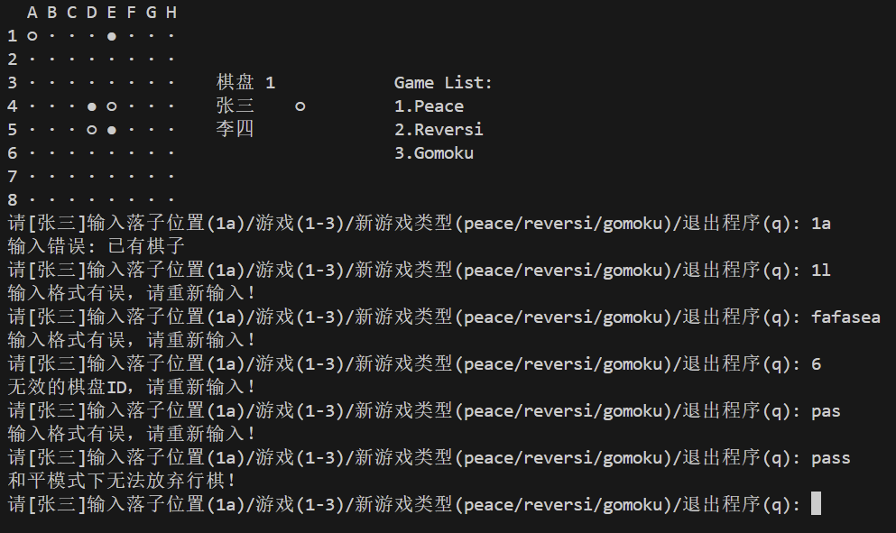

# Lab5说明文档
## 一、说明:
### 1. lab5实在lab4的基础上完成的,主要改动如下：
- 增加Gomoku类,用于实现五子棋游戏（主要）
- 修改Game中的playGame()方法,用于实现五子棋游戏（微改）
### 2. 其他文件均未改动，详情见lab4说明文档
### 3. 本说明文档主要讲解Gomoku类的实现
## 二、UML类图


## 三、变量和方法说明

### 变量

| 变量名        | 访问权限 | 类型    | 说明 |
|--------------|----------|---------|------|
| `round`      | private  | int     | 记录当前回合数 |
| `SIZE`       | protected| int     | 继承自Board类，棋盘大小(15x15) |
| `chessBoard` | protected| int[][] | 继承自Board类，存储棋盘状态 |
| `boardID`    | protected| int     | 继承自Board类，棋盘唯一标识 |
| `allBoards`  | protected| List\<Board\> | 继承自Board类，所有棋盘的集合 |

### 方法

| 方法名 | 访问权限 | 返回类型 | 说明 |
|--------|----------|----------|------|
| `Gomoku()` | public | - | 构造函数，初始化五子棋棋盘 |
| `setRound()` | public | void | 增加回合计数 |
| `initGomokuBoard()` | private | void | 初始化空棋盘 |
| `printBoard()` | public | void | 打印当前棋盘状态及游戏信息 |
| `checkWin()` | public static | boolean | 检查指定玩家是否获胜 |
| `checkDirection()` | private static | boolean | 检查指定方向是否有五子连线 |
| `isGameOver()` | public | boolean | 检查游戏是否结束 |

## 四、核心代码及其说明
### 1. `Gomoku()`

**功能**：初始化五子棋游戏

**详细说明**：
- 调用父类 `Board` 的构造方法完成基础初始化
- 通过 `initGomokuBoard()` 方法初始化15×15的空棋盘
- 设置棋盘类型为五子棋专用棋盘

**代码实现**：
```java
public Gomoku() {
    super(); // 调用父类构造函数
    initGomokuBoard(); // 初始化空棋盘
}
```

### 2.`initGomokuBoard()`

**功能**：初始化空棋盘

**详细说明**：
- 使用双重循环遍历整个8×8的棋盘
- 将每个位置的值设为0，表示空位
- 确保游戏开始时棋盘是干净的
- 使用 `SIZE` 常量(值为8)作为棋盘尺寸

**代码实现**：
```java
private void initGomokuBoard() {
    for (int i = 0; i < SIZE; i++) {
        for (int j = 0; j < SIZE; j++) {
            chessBoard[i][j] = 0; // 0表示空位
        }
    }
}
```

### 3.`setRound()`

**功能**：增加回合计数

**详细说明**：
- 每调用一次就将 `round` 加1
- 用于记录游戏进行的回合数
- 在玩家交替落子时调用

**代码实现**：
```java
public void setRound() {
    round++; // 回合数增加
}
```

### 4.`printBoard()`

**功能**：打印当前棋盘状态和游戏信息

**详细说明**：
- 清空控制台后打印棋盘
- 显示列标签(A-O)和行号(1-15)
- 用不同符号显示两位玩家的棋子
- 右侧显示玩家信息、当前回合数和游戏列表
- 支持高亮显示当前玩家

**代码实现**：
```java
@Override
public void printBoard(Player player1, Player player2, Player currentPlayer) {
    // 省略其他代码...
    //下次代码相对于父类中相应方法的变化
    if (i == 5) {
                System.out.print("Current round: ");// 添加空格以对齐棋盘列表
                System.out.printf("%2d", round); // 打印当前回合数
            }
            if (i > 5) {
                System.out.print("           ");// 添加空格以对齐棋盘列表
            }
            // 打印棋盘列表
            int j = i - 3;
            if (j < allBoards.size() && j >= 0) {
                Board board = allBoards.get(j);
                String boardType = "";// 声明变量以存储棋盘类型
                if (board instanceof ReversiBoard) {
                    boardType = "Reversi";
                } else if (board instanceof PeaceBoard) {
                    boardType = "Peace";
                } else if (board instanceof Gomoku) {
                    boardType = "Gomoku";
                }
                if (j != 2) {
                    System.out.print("         " + (j + 1) + "." + boardType);
                }else if (j == 2) {
                    System.out.print("   " + (j + 1) + "." + boardType);
                }
            }
}
```

### 5.`checkWin()`

**功能**：检查指定玩家是否获胜

**详细说明**：
- 遍历整个棋盘寻找指定玩家的棋子
- 对每个棋子检查四个方向(水平、垂直、两对角线)
- 任意方向有五子连线即返回true
- 使用 `checkDirection()` 辅助方法进行方向检查

**代码实现**：
```java
public static boolean checkWin(int[][] board, int playerID) {
    for (int row = 0; row < SIZE; row++) {
        for (int col = 0; col < SIZE; col++) {
            if (board[row][col] == playerID) {
                if (checkDirection(board, row, col, playerID, 1, 0) || // 水平
                    checkDirection(board, row, col, playerID, 0, 1) || // 垂直
                    checkDirection(board, row, col, playerID, 1, 1) || // 主对角线
                    checkDirection(board, row, col, playerID, 1, -1)) { // 副对角线
                    return true;
                }
            }
        }
    }
    return false;
}
```

### 6.`checkDirection()`

**功能**：检查指定方向是否有五子连线

**详细说明**：
- 从指定位置开始，沿给定方向(deltaRow/deltaCol)检查
- 连续统计相同玩家的棋子数
- 遇到不同棋子或边界则停止检查
- 返回是否找到五子连线

**代码实现**：
```java
private static boolean checkDirection(int[][] board, int row, int col, 
                                   int playerID, int deltaRow, int deltaCol) {
    int count = 0;
    for (int i = 0; i < 5; i++) {
        int newRow = row + i * deltaRow;
        int newCol = col + i * deltaCol;
        // 检查边界和棋子归属
        if (newRow >= 0 && newRow < SIZE && 
            newCol >= 0 && newCol < SIZE && 
            board[newRow][newCol] == playerID) {
            count++;
        } else {
            break;
        }
    }
    return count == 5;
}
```

### 7.`isGameOver()`

**功能**：判断游戏是否结束

**详细说明**：
- 首先检查是否有玩家获胜
- 如果没有玩家获胜，检查棋盘是否已满
- 棋盘已满且无人获胜视为平局
- 返回true表示游戏结束，false表示继续

**代码实现**：
```java
@Override
public boolean isGameOver(Player player1, Player player2, Player currentPlayer) {
    // 检查玩家胜利
    if (checkWin(chessBoard, 1) || checkWin(chessBoard, 2)) {
        return true;
    }
    // 检查棋盘是否已满
    for (int i = 0; i < SIZE; i++) {
        for (int j = 0; j < SIZE; j++) {
            if (chessBoard[i][j] == 0) {
                return false; // 还有空位
            }
        }
    }
    return true; // 棋盘已满
}
```

### 游戏流程说明

1. **初始化**：创建15x15的空棋盘，回合数设为0
2. **轮流下棋**：玩家交替在棋盘上落子
3. **胜利判定**：每次落子后检查四个方向是否有五子连线
4. **游戏结束**：当一方达成五子连线或棋盘填满时游戏结束
5. **显示信息**：打印棋盘时同时显示玩家信息、当前回合数和游戏列表

## 五、运行结果及截图
- 1.棋盘打印：
    
    
- 2.Peace游戏逻辑 & Reversi游戏逻辑:
   详见lab4说明文档
- 3.Gomoku游戏逻辑：
   - 3.1 初始化棋盘：
      
   - 3.2 A下棋之后，轮到B下棋；反之亦然：
   - 
   - 
   - 3.3 正确计算当前轮数并打印：
     
   - 3.4 合理应对⾮法输⼊、给出错误提⽰：
     
   - 3.5 有⼀⽅五⼦连线后，打印赢家，并结束该棋盘&实现五⼦连线的判断逻辑：
     
- 4.添加新游戏：
   - 4.1 实现新游戏的棋盘类：
    
    
   - 4.2 切换到新游戏能够正常进行：
   
   
- 5.退出游戏：
   
   
  